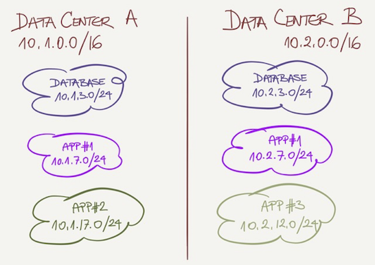
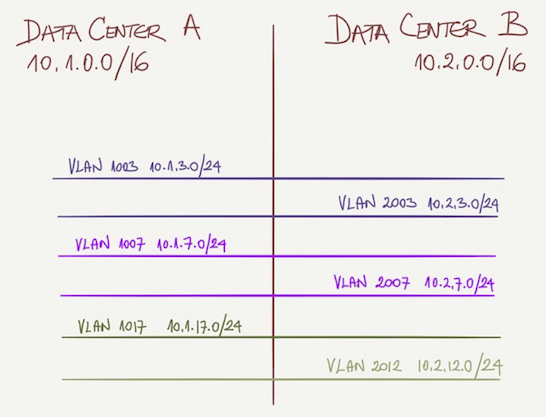
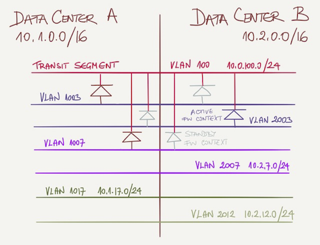

# Design a Robust Layer-2 Fabric

ACME Inc. is replacing an existing data center fabric with a next-generation solution. They have two data centers less than 100 km apart and decided to implement a layer-2 interconnect and long-distance vMotion to simplify hardware maintenance.

Most compute workloads are virtualized, but they still have a cluster of bare-metal servers running legacy database servers.

## Existing Fabric Design

ACME architects are aware of the limitations of stretched VLANs (including increased latency and traffic flows crossing the data center interconnect) and have tried to limit their impact by deploying each application stack mainly within a single data center:

* Each data center is assigned a /16 prefix from 10.0.0.0/8 address space;
* Legacy application stacks (or groups of applications) are assigned to one of the data centers and get a single VLAN and a single /24 IP subnet belonging to that data center;
* Applications with scale-out architecture are assigned two VLANs and two /24 IP subnets (one from the address space of each data center);

A typical addressing plan is shown in the following diagram:

All VLANs are stretched across both data centers, allowing unlimited (but controlled) VM mobility. However, ACME took these precautions to minimize cross-DC traffic:

* Hosts belonging to a single IP subnet SHOULD reside within a single data center but COULD be moved to the other data center if needed;
* Applications SHOULD use common services (example: Windows AD, backup…) within the same data center but COULD use services from the other data center (example: shared database).

You’ll find an overview of L2/L3 connectivity in the following diagram:

## External Connectivity

Application segments are connected to a shared transit segment through stateful firewalls. Each application segment is an independent virtual context within the firewall.

The firewalls are physical appliances deployed in an active/backup stretched cluster. Each virtual context is active only on one of the appliances, while different contexts could be active on different appliances to get per-context load balancing. The primary virtual context for each application is within the same data center as its application (the following diagram displays a few contexts).

## New Fabric Requirements

ACME wants to replace the existing L2-only fabric that uses the Spanning Tree Protocol (STP) and MLAG with a modern data center fabric without changing applications or firewall configurations.

Given these limitations, design the most stable data center fabric you can.
